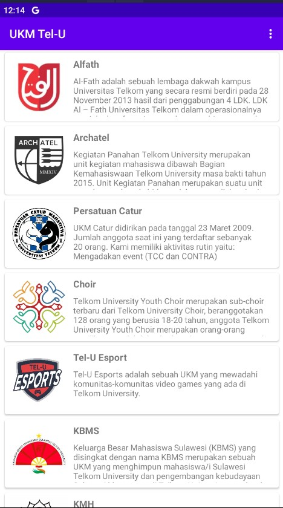
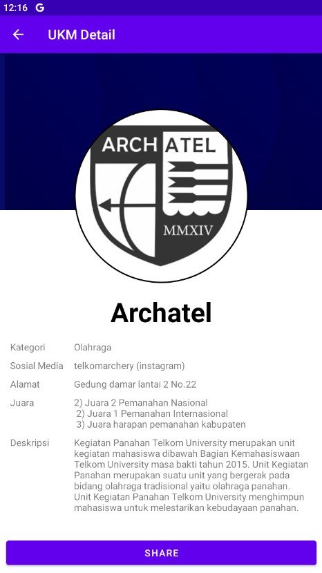
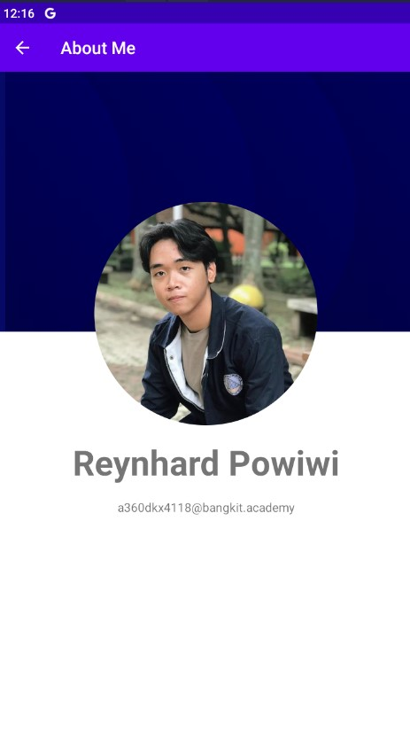

# Submission_Dicoding-Belajar_Membuat_Aplikasi_Android_untuk_Pemula
Halo, saya Reynhard Powiwi! Ini adalah projek UKM Fair APK. 🚀 Aplikasi ini berguna untuk menampilkan informasi List UKM di Telkom University. 🏫 Dengan aplikasi ini, mahasiswa baru dapat dengan mudah mendapatkan informasi mengenai UKM yang ada di Telkom University.

# Fitur-Fitur
- 📋 Daftar UKM: Aplikasi menampilkan daftar UKM yang tersedia di Telkom University, memberikan informasi mengenai kegiatan, kontak, dan jadwal pertemuan masing-masing UKM.
- ℹ️ Informasi Detail: Aplikasi menyediakan informasi detail mengenai setiap UKM, termasuk deskripsi dan informasi kontak.

# Screenshot Aplikasi
Berikut adalah beberapa screenshot dari aplikasi UKM Fair APK:

   

Selamat mencoba dan semoga aplikasi ini dapat membantu mahasiswa baru dalam menjelajahi dan bergabung dengan UKM yang menarik di Telkom University! 😉✨
